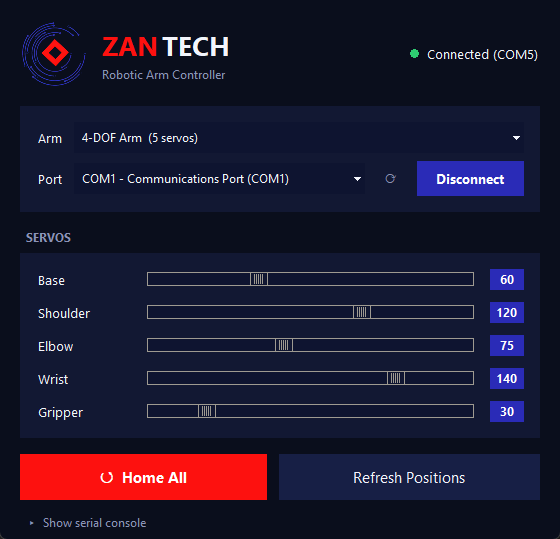
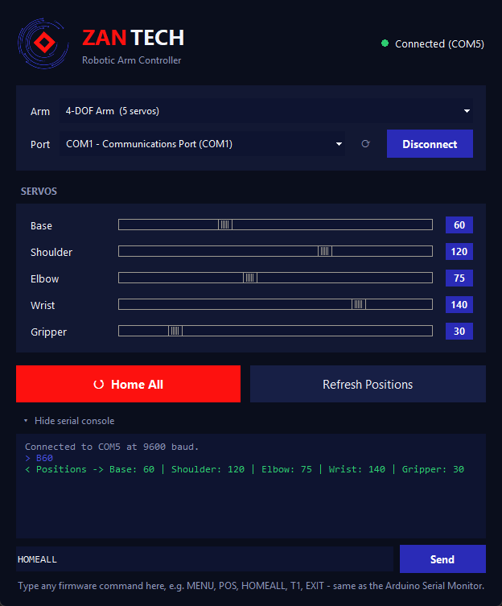
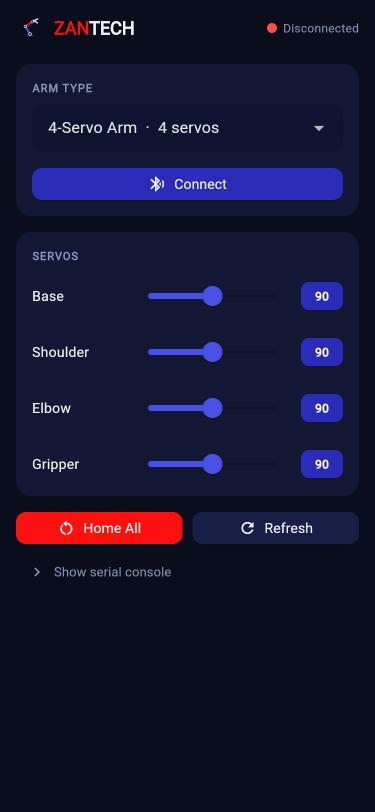
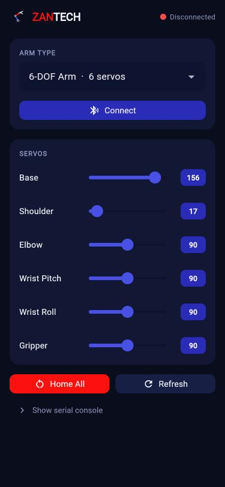
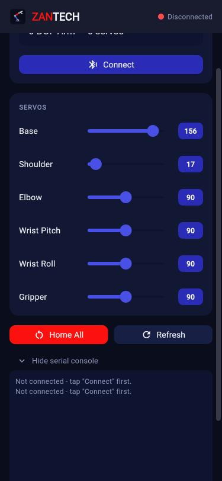
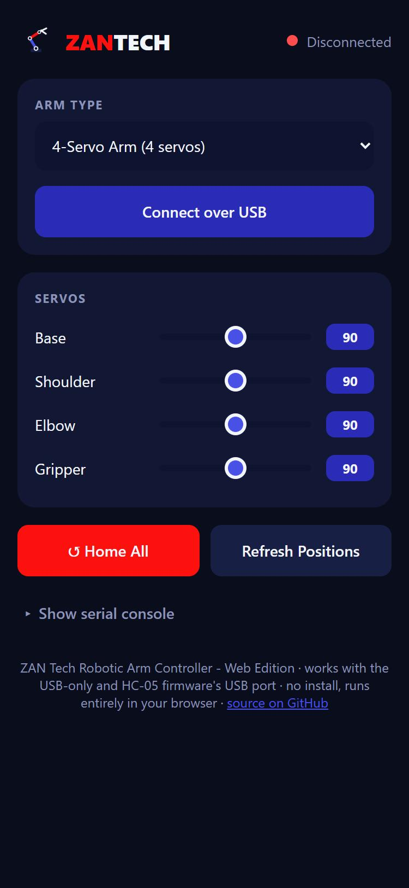

# ZAN Tech Robotic Arm Controller — 4-Servo, 4-DOF & 6-DOF

[](LICENSE)
[](https://github.com/ZAN-Tech-bd/Robotc-Arm-controll)

**Free and open source. Build a robot arm, flash one file, open an app, drag some sliders.**
This repo has everything you need: Arduino firmware for a 4-servo arm, a 5-servo (4-DOF)
arm, *or* a 6-servo (6-DOF) arm — plus **three different apps to control it**, so you can
pick whichever fits your setup: a **PC app** (Python, USB), a **mobile app**
(Android, Bluetooth), and a **web app** (any Chrome/Edge browser, USB, zero install).
No coding and no typing commands required to actually use the arm with any of them.

```
┌──────────────────────────┐                           ┌───────────────────────────┐
│  ZAN Tech PC App          │ ◄── USB Serial ─────────► │                           │
│  (Python, double-click)   │     "B90\n" "S45\n" etc.  │   Arduino Nano / ESP32    │
├──────────────────────────┤                           │   drives 4, 5 or 6 servos  │
│  ZAN Tech Mobile App      │ ◄── Bluetooth (HC-05/     │   0-180° each, smooth move │
│  (Android, Flutter)       │     ESP32 built-in) ─────►│                           │
├──────────────────────────┤                           │                           │
│  ZAN Tech Web App         │ ◄── USB Serial ─────────► │                           │
│  (Chrome/Edge, no install)│     via Web Serial API    │                           │
└──────────────────────────┘                           └───────────────────────────┘
```



---

## 1. Which arm do you have?

| | 4-Servo Arm | 4-DOF Arm | 6-DOF Arm |
|---|---|---|---|
| Servos | 4 (Base, Shoulder, Elbow, Gripper) | 5 (Base, Shoulder, Elbow, Wrist, Gripper) | 6 (Base, Shoulder, Elbow, Wrist **Pitch**, Wrist **Roll**, Gripper) |
| Firmware file | [`firmware/4servo-arm/4servo-arm.ino`](firmware/4servo-arm/4servo-arm.ino) | [`firmware/4dof-arm/4dof-arm.ino`](firmware/4dof-arm/4dof-arm.ino) | [`firmware/6dof-arm/6dof-arm.ino`](firmware/6dof-arm/6dof-arm.ino) |
| Good for | The simplest/cheapest build — no wrist joint, just reach + grip | Simpler builds, cheaper kits, beginners | Arms that also need to rotate the gripper (wrist roll) |

All three run on the same hardware (**Arduino Nano**), use the same serial protocol style,
and are controlled by the **same PC app** — you just tell the app which one you built.

---

## 2. What's in this repo

```
4-Dof-Robotc-Arm-controll/
├── firmware/
│   ├── 4servo-arm/
│   │   └── 4servo-arm.ino         # USB-only, 4-servo arm (Nano)
│   ├── 4servo-arm-hc05/
│   │   └── 4servo-arm-hc05.ino    # Same arm, + HC-05 Bluetooth (Nano)
│   ├── 4servo-arm-esp32/
│   │   └── 4servo-arm-esp32.ino   # Same arm, on ESP32 with built-in Bluetooth
│   ├── 4dof-arm/
│   │   └── 4dof-arm.ino           # USB-only, 5-servo arm (Nano)
│   ├── 4dof-arm-hc05/
│   │   └── 4dof-arm-hc05.ino      # Same arm, + HC-05 Bluetooth (Nano)
│   ├── 4dof-arm-esp32/
│   │   └── 4dof-arm-esp32.ino     # Same arm, on ESP32 with built-in Bluetooth
│   ├── 6dof-arm/
│   │   └── 6dof-arm.ino           # USB-only, 6-servo arm (Nano)
│   ├── 6dof-arm-hc05/
│   │   └── 6dof-arm-hc05.ino      # Same arm, + HC-05 Bluetooth (Nano)
│   └── 6dof-arm-esp32/
│       └── 6dof-arm-esp32.ino     # Same arm, on ESP32 with built-in Bluetooth
├── pc-app/
│   ├── assets/
│   │   ├── zantech_logo.png        # Header logo shown in the app
│   │   └── zantech_logo_icon.png   # App window icon
│   ├── arm_controller_gui.py       # The PC app (controls either arm)
│   ├── requirements.txt            # One dependency: pyserial
│   └── Run Arm Controller.bat      # Double-click this - no terminal needed
├── mobile-app/
│   ├── lib/main.dart               # The Flutter app (Android, Bluetooth)
│   ├── releases/                   # Built APKs land here locally (not committed)
│   └── README.md                   # Mobile app details / build instructions
├── web-app/
│   ├── index.html                  # The entire web app (USB, no install needed)
│   ├── assets/                     # Logo/icon used by the web app
│   └── README.md                   # Web app details / hosting notes
├── docs/
│   └── screenshots/                # Images used in this README
└── README.md                       # You are here
```

---

## 3. Parts list

- 1x **Arduino Nano** (for the USB-only or HC-05 firmware) **or** 1x **ESP32 dev board**
  (for the ESP32 Bluetooth firmware — see Section 5)
- 4x servos (4-Servo arm) **or** 5x servos (4-DOF arm) **or** 6x servos (6-DOF arm) —
  standard 180° hobby servos
- *Optional, Nano only:* 1x **HC-05 Bluetooth module**, if you want wireless control
  without switching to an ESP32
- An external **5V power supply** for the servos if you have more than 2-3 of them (the
  Nano's/ESP32's own USB power usually isn't enough — servos will twitch or the board
  will reset)
- Jumper wires + a breadboard (or your arm kit's wiring harness)

---

## 4. Wiring

All servos are 3-wire (Signal, VCC/5V, GND). **Share ground** between the Nano and any
external power supply, or the servos will jitter or not respond at all.

### 4-Servo Arm (4 servos)

| Servo | Signal Pin (Nano) |
|---|---|
| Base | **D3** |
| Shoulder | **D5** |
| Elbow | **D6** |
| Gripper | **D9** |

```
                         ┌───────────────────────────┐
                         │       Arduino Nano        │
   BASE SERVO             │                           │
   ┌───────────────┐     │                           │
   │ Signal        ├─────┤ D3                        │
   │ VCC (5V)      ├─────┤ 5V (external supply       │
   │ GND           ├─────┤ GND  recommended)          │
   └───────────────┘     │                           │
   SHOULDER SERVO         │                           │
   ┌───────────────┐     │                           │
   │ Signal        ├─────┤ D5                        │
   │ VCC / GND     ├─────┤ 5V / GND                  │
   └───────────────┘     │                           │
   ELBOW SERVO             │                           │
   ┌───────────────┐     │                           │
   │ Signal        ├─────┤ D6                        │
   │ VCC / GND     ├─────┤ 5V / GND                  │
   └───────────────┘     │                           │
   GRIPPER SERVO           │                           │
   ┌───────────────┐     │                           │
   │ Signal        ├─────┤ D9                        │
   │ VCC / GND     ├─────┤ 5V / GND                  │
   └───────────────┘     └───────────────────────────┘
```

### 4-DOF Arm (5 servos)

| Servo | Signal Pin (Nano) |
|---|---|
| Base | **D3** |
| Shoulder | **D5** |
| Elbow | **D6** |
| Wrist | **D9** |
| Gripper | **D10** |

```
                         ┌───────────────────────────┐
                         │       Arduino Nano        │
   BASE SERVO             │                           │
   ┌───────────────┐     │                           │
   │ Signal        ├─────┤ D3                        │
   │ VCC (5V)      ├─────┤ 5V (external supply       │
   │ GND           ├─────┤ GND  recommended)          │
   └───────────────┘     │                           │
   SHOULDER SERVO         │                           │
   ┌───────────────┐     │                           │
   │ Signal        ├─────┤ D5                        │
   │ VCC / GND     ├─────┤ 5V / GND                  │
   └───────────────┘     │                           │
   ELBOW SERVO             │                           │
   ┌───────────────┐     │                           │
   │ Signal        ├─────┤ D6                        │
   │ VCC / GND     ├─────┤ 5V / GND                  │
   └───────────────┘     │                           │
   WRIST SERVO             │                           │
   ┌───────────────┐     │                           │
   │ Signal        ├─────┤ D9                        │
   │ VCC / GND     ├─────┤ 5V / GND                  │
   └───────────────┘     │                           │
   GRIPPER SERVO           │                           │
   ┌───────────────┐     │                           │
   │ Signal        ├─────┤ D10                       │
   │ VCC / GND     ├─────┤ 5V / GND                  │
   └───────────────┘     └───────────────────────────┘
```

### 6-DOF Arm (6 servos)

| Servo | Signal Pin (Nano) |
|---|---|
| Base | **D3** |
| Shoulder | **D5** |
| Elbow | **D6** |
| Wrist Pitch (up/down) | **D9** |
| Wrist Roll (rotate gripper) | **D10** |
| Gripper | **D11** |

```
                         ┌───────────────────────────┐
                         │       Arduino Nano        │
   BASE → D3              │                           │
   SHOULDER → D5           │                           │
   ELBOW → D6               │                           │
   WRIST PITCH → D9         │                           │
   WRIST ROLL → D10         │                           │
   GRIPPER → D11            │                           │
                         │  (same Signal/5V/GND       │
                         │   wiring pattern as the    │
                         │   4-DOF table above)       │
                         └───────────────────────────┘
```

---

## 5. Flashing the firmware

Each arm (4-Servo / 4-DOF / 6-DOF) has **three firmware options** — pick one per arm,
depending on how you want to talk to it:

| Variant | Folder suffix | Needs | Connects over |
|---|---|---|---|
| **USB only** | *(none)* | Arduino Nano | USB cable (wired Serial Monitor / PC app) |
| **USB + HC-05 Bluetooth** | `-hc05` | Arduino Nano + HC-05 module | USB cable, *or* Bluetooth via the HC-05 |
| **ESP32 Bluetooth** | `-esp32` | ESP32 dev board (no Nano, no HC-05) | USB cable, *or* the ESP32's built-in Bluetooth |

All three speak the **exact same command protocol** (Section 7) — the PC app and the
Arduino IDE Serial Monitor work identically against any of them.

### USB-only (Arduino Nano)

1. Install the **Arduino IDE**.
2. Plug the Nano into your PC with USB.
3. Open the right `.ino` for your arm:
   - 4-Servo → `firmware/4servo-arm/4servo-arm.ino`
   - 4-DOF → `firmware/4dof-arm/4dof-arm.ino`
   - 6-DOF → `firmware/6dof-arm/6dof-arm.ino`
4. Select **Board: Arduino Nano** and the correct **Port**.
5. Click **Upload**.

No extra libraries needed — `Servo.h` ships with the Arduino IDE.

### USB + HC-05 Bluetooth (Arduino Nano)

Same Nano, with an **HC-05 Bluetooth module** added so you can also control the arm
wirelessly from a phone, with no code changes needed to switch between them.

1. Wire the HC-05: **VCC** → 5V (or 3.3V — check your module), **GND** → GND,
   **TXD** → Nano **D2**, **RXD** → Nano **D4** (through a simple voltage divider,
   e.g. 1kΩ + 2kΩ resistors, since the HC-05's RXD is 3.3V logic).
2. Open the `-hc05` sketch for your arm:
   - 4-Servo → `firmware/4servo-arm-hc05/4servo-arm-hc05.ino`
   - 4-DOF → `firmware/4dof-arm-hc05/4dof-arm-hc05.ino`
   - 6-DOF → `firmware/6dof-arm-hc05/6dof-arm-hc05.ino`
3. Select **Board: Arduino Nano**, the correct **Port**, and click **Upload**.
4. On your phone, pair with the HC-05 (default PIN is usually `1234` or `0000`).
5. Open a serial Bluetooth terminal app (e.g. **"Serial Bluetooth Terminal"** on
   Android), connect to the paired HC-05, and send the same commands as Section 7.

No extra libraries needed beyond what ships with the Arduino IDE
(`Servo.h` + `SoftwareSerial.h`, both built in).

> On Windows, a paired HC-05 also shows up as a normal **COM port** — so the PC app
> in Section 6 can connect to it directly too, exactly like a USB cable, just pick
> that COM port in the dropdown instead of the Nano's USB one.

### ESP32 Bluetooth (no Nano, no HC-05)

If you'd rather build the arm around an **ESP32** instead of a Nano, it has Bluetooth
built in — no separate HC-05 module needed.

1. In the Arduino IDE, install ESP32 board support (**File → Preferences → Additional
   Boards Manager URLs**, then **Tools → Board → Boards Manager** → search "esp32").
2. Install the **"ESP32Servo"** library (**Tools → Manage Libraries** → search
   "ESP32Servo" by Kevin Harrington / John K. Bennett). The AVR `Servo.h` used by the
   Nano sketches doesn't work on ESP32 — this is its drop-in replacement.
3. Wire your servos to the GPIOs listed at the top of the `-esp32` sketch for your arm
   (different from the Nano pin numbers) — power them from an external 5V supply, not
   the ESP32's own 5V/3.3V pin.
4. Open the `-esp32` sketch for your arm:
   - 4-Servo → `firmware/4servo-arm-esp32/4servo-arm-esp32.ino`
   - 4-DOF → `firmware/4dof-arm-esp32/4dof-arm-esp32.ino`
   - 6-DOF → `firmware/6dof-arm-esp32/6dof-arm-esp32.ino`
5. Select your **ESP32 board** and **Port**, then click **Upload**.
6. On your phone, pair with the Bluetooth name printed at the top of that sketch
   (e.g. `ZANTECH_ARM_4DOF`) — no PIN needed by default.
7. Open a serial Bluetooth terminal app, connect, and send the same commands as
   Section 7. The paired ESP32 also shows up as a COM port on Windows, so the PC app
   can connect to it the same way as the HC-05 above.

---

Once uploaded (any variant), every servo snaps to 90° (home), settles for half a
second, then the firmware stops sending it a signal until you give it a real command —
so the arm holds still and never drifts or twitches on its own while idle. When you do
send a new angle, the servo doesn't jump — it sweeps there smoothly in 5° steps.

---

## 6. Running the PC app

### Easiest way — just double-click it

1. Install **Python 3** from [python.org](https://www.python.org/downloads/) if you don't
   have it (tick **"Add Python to PATH"** during install).
2. Open the `pc-app` folder.
3. Double-click **`Run Arm Controller.bat`**.

That's it — no terminal, no typing `python` commands. The first run installs the one
required package (`pyserial`) automatically, then opens the app window. If something's
wrong (Python missing, etc.) it tells you instead of silently doing nothing.

> If double-clicking it does nothing and no window appears, check `crash_log.txt` next
> to it for the error details.

### Manual way (optional)

```bash
cd pc-app
pip install -r requirements.txt
python arm_controller_gui.py
```

### There are two ways to control the arm — use either, or both

**A) Sliders** (the easy way — recommended for everyone):

1. **Arm Type** — pick "4-Servo Arm", "4-DOF Arm", or "6-DOF Arm" to match the firmware
   you flashed. The slider panel updates automatically.
2. **Port** — pick your Arduino's port. It's labeled with its description (e.g.
   `COM3 - USB-SERIAL CH340`) so you can tell it apart from unrelated ports like your
   PC's built-in `COM1`.
3. Click **Connect**. The status dot turns green when it's talking to the arm. If the
   arm doesn't reply to a quick test command within 1.5 seconds, the app warns you —
   that usually means the wrong port or the wrong Arm Type was selected.
4. **Drag any slider** — that joint moves on the real arm immediately.
5. **Home All** — snaps every joint back to 90° (center).
6. **Refresh Positions** — asks the arm what angle every servo is currently at.

**B) Typed commands** (the power-user way — for scripting, testing, or fine control):

Click **"▸ Show serial console"** at the bottom of the app to reveal a command box —
type any firmware command directly (`MENU`, `POS`, `HOMEALL`, `T1`, `EXIT`, `B45 E120`,
etc.) and press Enter or click Send. This works exactly like the Arduino IDE's Serial
Monitor, but without leaving the app, and you can see the arm's replies live. Typing a
servo command here (e.g. `B45`) also moves that slider to match, so the sliders and the
console never fall out of sync with each other.



> You can also use the **real Arduino IDE Serial Monitor** instead (9600 baud, line
> ending set to "Newline") if you'd rather not use the PC app at all — it's the exact
> same protocol either way. The full command list for each arm is below.

---

## 7. Serial command reference

Every command below works identically whether you type it into the app's built-in
serial console or the Arduino IDE's Serial Monitor — the firmware doesn't know or care
which one sent it.

**4-Servo Arm:**
```
MENU                  -> show the full command list
B90 S90 E90 G90       -> move all 4 servos together in one line
B45 E120              -> move only the servos you mention
HOMEALL               -> center every servo at 90 degrees
POS                   -> print the current angle of every servo
T1                    -> select servo 1 (Base) to test by itself (T1-T4)
HOME                  -> (while in T1-T4 test mode) center just that one servo
EXIT                  -> leave test mode
```

**4-DOF Arm:**
```
MENU                  -> show the full command list
B90 S90 E90 W90 G90   -> move all 5 servos together in one line
B45 E120              -> move only the servos you mention
HOMEALL               -> center every servo at 90 degrees
POS                   -> print the current angle of every servo
T1                    -> select servo 1 (Base) to test by itself (T1-T5)
HOME                  -> (while in T1-T5 test mode) center just that one servo
EXIT                  -> leave test mode
```

**6-DOF Arm:**
```
MENU                        -> show the full command list
B90 S90 E90 P90 R90 G90     -> move all 6 servos together in one line
B45 P120                    -> move only the servos you mention
HOMEALL                     -> center every servo at 90 degrees
POS                         -> print the current angle of every servo
T1                          -> select servo 1 (Base) to test by itself (T1-T6)
HOME                        -> (while in T1-T6 test mode) center just that one servo
EXIT                        -> leave test mode
```

| Command | 4-Servo letters | 4-DOF letters | 6-DOF letters |
|---|---|---|---|
| Base | `B` | `B` | `B` |
| Shoulder | `S` | `S` | `S` |
| Elbow | `E` | `E` | `E` |
| Wrist | — | `W` | — |
| Wrist Pitch | — | — | `P` |
| Wrist Roll | — | — | `R` |
| Gripper | `G` | `G` | `G` |

---

## 8. Troubleshooting

| Symptom | Fix |
|---|---|
| App says "Port is busy" | Close the Arduino IDE's Serial Monitor, or any other copy of this app, or any other serial tool — only one program can use a COM port at a time. |
| Connected, but arm doesn't move | You probably picked the wrong port (e.g. your PC's built-in COM1) or the wrong Arm Type. The app should warn you about this automatically within ~1.5s of connecting. |
| No port appears in the dropdown | Click Refresh. Make sure the USB cable is a *data* cable, not charge-only. |
| Servos twitch, reset, or seem to "move by themselves" | Power the servos from an external 5V supply (not the Nano's USB power) and share ground between the supply and the Nano. The firmware already detaches idle servos to prevent signal jitter — this is almost always a power issue. |
| Arm moves the wrong joint | Double-check the wiring table in Section 4 — each servo's signal wire must go to its matching pin, and make sure you flashed the firmware that matches your arm (4-Servo vs 4-DOF vs 6-DOF). |
| Your arm needs to stay powered while idle (e.g. shoulder sags under gravity) | Open the `.ino` file for your arm and set `DETACH_WHEN_IDLE` to `false`, then re-upload. |
| HC-05 won't pair, or pairing fails | Double-check VCC/GND and that TXD/RXD aren't swapped (HC-05 TXD → Nano RX pin, HC-05 RXD → Nano TX pin). Most modules default to pairing PIN `1234` or `0000`. |
| Arm doesn't respond over Bluetooth, but USB works fine | Make sure you uploaded the `-hc05` or `-esp32` sketch (not the plain USB-only one) — only those listen on Bluetooth. Also confirm your phone is actually connected/paired, not just in range. |
| ESP32 sketch won't compile | Install the **ESP32** board package and the **ESP32Servo** library (Section 5) — the plain `Servo.h` that ships with the IDE doesn't support ESP32. |
| Mobile app can't find my device | Make sure you flashed a `-hc05` or `-esp32` firmware (the plain USB-only `.ino` has no Bluetooth) and that it's already **paired** in your phone's Bluetooth settings first — the app connects to paired devices, Android's classic-Bluetooth discovery is unreliable for pairing from inside an app. |
| Mobile app asks for a permission / location toggle | Android needs the Bluetooth (and on Android 11 and below, Location) permission granted, and on older Android the system **Location toggle** switched on, purely to scan for classic Bluetooth devices — the app never reads or sends your actual location. |

---

## 9. Mobile app (Android)

A Flutter-based Android app in [`mobile-app/`](mobile-app/) gives you the same
"pick your arm, connect, drag sliders" experience as the PC app, but on your
phone over Bluetooth — a clean, modern remote for the `-hc05` and `-esp32`
firmware variants.

<table>
<tr>
<td></td>
<td></td>
<td></td>
</tr>
<tr>
<td align="center">Main screen (4-Servo arm)</td>
<td align="center">6-DOF arm, sliders in use</td>
<td align="center">Serial console panel</td>
</tr>
</table>

### Download and install

1. Grab the latest `zantech-arm-controller-vX.Y.Z.apk` from the
   [**Releases** page](https://github.com/ZAN-Tech-bd/Robotc-Arm-controll/releases).
2. On your Android phone, open the downloaded APK. If this is your first app
   installed outside the Play Store, Android will ask you to allow
   **"Install unknown apps"** for your browser/file manager — allow it, then
   tap Install.
3. Pair your HC-05 or ESP32 with your phone in **Settings → Bluetooth** first
   (default HC-05 PIN is usually `1234` or `0000`; the ESP32 firmware needs
   no PIN).
4. Open the app, pick your **Arm Type**, tap **Connect**, choose your paired
   device, and drag the sliders.

Requires **Android 7.0 (API 24) or newer**.

### How to use it

1. **Arm Type** — pick 4-Servo / 4-DOF / 6-DOF to match the firmware you
   flashed. The servo list below it updates automatically (4, 5, or 6 sliders).
2. **Connect** — tap it to open the device picker. It lists already-**paired**
   devices first, and (where your Android version allows it) a **Scan**
   button to discover nearby ones too. Tap your HC-05 or ESP32 to connect.
   The status dot in the top-right turns green once connected.
3. **Drag a slider** — that joint moves on the real arm as soon as you let go
   (not while dragging, to avoid flooding the Bluetooth link with every
   intermediate value).
4. **Home All** — snaps every joint back to 90° (the arm's assembled/center
   position) and resets all the sliders to match.
5. **Refresh** — asks the arm what angle every servo is actually at right now
   (useful after using the serial console, or if the app and arm ever look
   out of sync).
6. **Show serial console** — expands a log + command box at the bottom, for
   typing any raw firmware command directly (`MENU`, `POS`, `T1`, `B45 E120`,
   `HOMEALL`, ...) and watching the arm's replies live — the mobile
   equivalent of the Arduino IDE's Serial Monitor. Sending a servo command
   here also moves the matching slider, so they never fall out of sync.

### Features

Same controls as the PC app: an Arm Type selector (4-Servo / 4-DOF / 6-DOF),
a slider per servo, **Home All** / **Refresh** buttons, and a collapsible
serial console for typing raw firmware commands (`MENU`, `POS`, `T1`, ...)
exactly like the Arduino Serial Monitor.

### Building it yourself

```bash
cd mobile-app
flutter pub get
flutter build apk --release
```

See [`mobile-app/README.md`](mobile-app/README.md) for the full build/dev guide.

---

## 10. Web app (no install needed)

Don't have Python, or just want to open a web page instead of installing
anything? [`web-app/index.html`](web-app/index.html) is a single static HTML
file that controls the arm straight from **Chrome or Edge**, over USB, using
the browser's built-in [Web Serial API](https://developer.chrome.com/docs/capabilities/serial) -
no Python, no build step, no server required.



### Use it

1. Download [`web-app/index.html`](web-app/index.html) and its `assets/`
   folder (same folder, next to each other), then just **double-click
   `index.html`** to open it in Chrome or Edge — Web Serial works fine from a
   local file, no hosting needed. (Or open the hosted copy, if this repo has
   GitHub Pages enabled — see [`web-app/README.md`](web-app/README.md).)
2. Pick your **Arm Type**, plug the board in over USB, click
   **Connect over USB**, and choose it from the browser's own device picker.
3. Drag the sliders. **Home All**, **Refresh Positions**, and the serial
   console work exactly like the PC app.

This only works over **USB** — Web Serial doesn't do Bluetooth (browsers only
expose BLE to web pages, not the classic Bluetooth/SPP that HC-05 and the
ESP32 firmware use). For Bluetooth, use the [mobile app](#9-mobile-app-android)
instead. See [`web-app/README.md`](web-app/README.md) for details and limits.

---

## 11. License

**MIT License** — see [LICENSE](LICENSE).

This project is free and open source. You can use, copy, modify, merge, publish,
distribute, and even sell copies of it — for learning, hobby builds, classroom use, or
commercial products — as long as the original copyright notice and license text are
kept. No warranty is provided; build and use at your own risk.

Contributions, forks, and pull requests are welcome.
