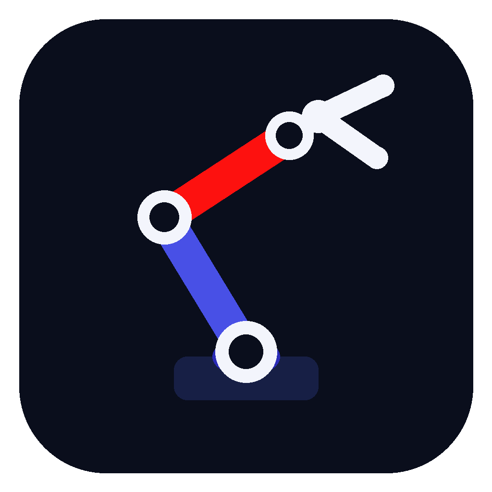

# ZAN Tech Arm Controller (Flutter mobile app)

A clean, modern Bluetooth remote for the robotic arms in this repo, built with
Flutter. It's the mobile sibling of [`pc-app/arm_controller_gui.py`](../pc-app/arm_controller_gui.py) -
same idea (pick your arm type, connect, drag sliders), but from your phone
over Bluetooth instead of a USB cable on a PC.

It talks to any of the Bluetooth firmware variants in [`../firmware/`](../firmware/)
(the `-hc05` and `-esp32` sketches) using the exact same serial command
protocol as the PC app and the Arduino Serial Monitor - e.g. sending `B90\n`
moves the Base servo to 90°.



## Download

Grab the latest signed APK from the
[Releases page](https://github.com/ZAN-Tech-bd/4-Dof-Robotc-Arm-controll/releases) -
no build tools needed. See the main [repo README](../README.md#9-mobile-app-android)
for install steps (you'll need to allow "install from unknown sources" since
this isn't on the Play Store).

## Features

- **Pick your arm**: 4-Servo / 4-DOF / 6-DOF, same three profiles as the PC app.
- **Scan & connect**: lists paired Bluetooth devices and can discover nearby
  ones, then connects over classic Bluetooth (RFCOMM/SPP) - works with an
  HC-05 module on a Nano or an ESP32's built-in Bluetooth.
- **Sliders per servo**: drag to move a joint live; the angle sends as soon as
  you release.
- **Home All / Refresh**: center every servo, or ask the arm what angle it's
  currently at.
- **Serial console**: an optional expandable panel to type any raw firmware
  command (`MENU`, `POS`, `T1`, `B45 E120`, ...) and watch the arm's replies,
  same as the Arduino Serial Monitor.

## Building it yourself

Requires the [Flutter SDK](https://docs.flutter.dev/get-started/install) and
Android SDK/platform tools.

```bash
cd mobile-app
flutter pub get
flutter build apk --release
```

The APK lands at `build/app/outputs/flutter-apk/app-release.apk`.

To regenerate the launcher icon after changing `assets/images/app_icon.png`
or `app_icon_foreground.png`:

```bash
dart run flutter_launcher_icons
```

## Project structure

```
mobile-app/
├── lib/
│   └── main.dart              # The entire app (UI + Bluetooth logic)
├── assets/images/
│   ├── app_icon.png           # Launcher icon (full, with background)
│   ├── app_icon_foreground.png# Launcher icon (adaptive-icon foreground layer)
│   └── zantech_logo*.png      # Shared ZAN Tech brand assets
├── android/                   # Android project (the only platform this app ships for)
└── releases/                  # Built APKs live here locally (git-ignored - see .gitignore)
```

## Bluetooth library

Uses [`flutter_classic_bluetooth`](https://pub.dev/packages/flutter_classic_bluetooth)
for classic Bluetooth (RFCOMM/SPP) - the same transport HC-05 modules and the
ESP32's built-in Bluetooth speak. This is **not** Bluetooth Low Energy (BLE);
make sure you flashed one of the `-hc05` or `-esp32` firmware variants
(the plain USB-only `.ino` files have no Bluetooth at all).
